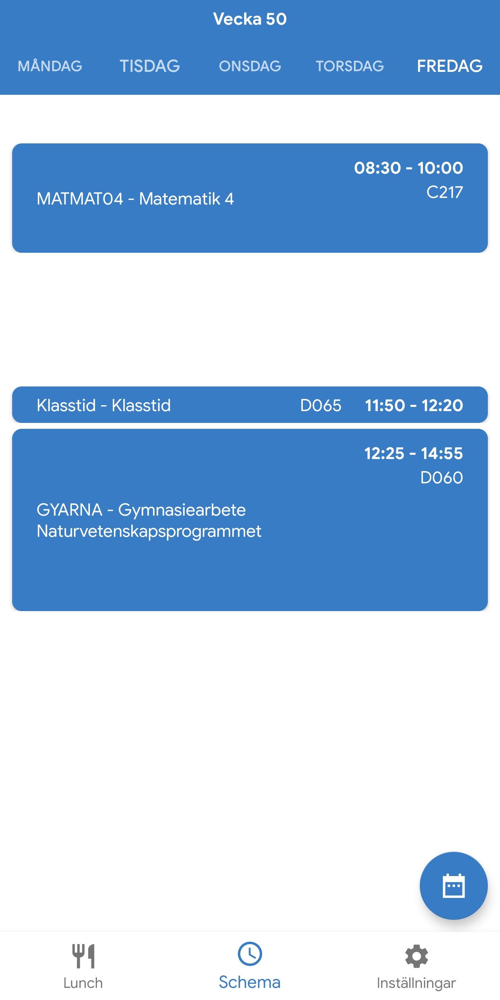
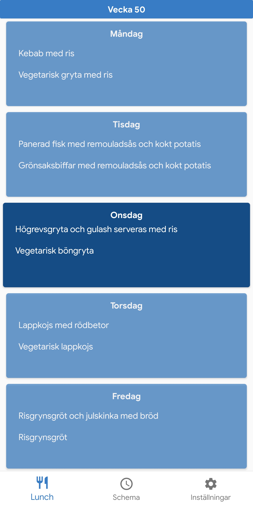

# Blatzarsoft

Blatzarsoft is a free and open source app to easily view schedule and lunch in the same app.
Any and all feature requests are welcome :)

  

## TODO checklist

- Colors for lessons
- Settings
- Dark mode
- More language support (English and Swedish)
- Upload to play store

## Can I trust this app with my login details?

This entire app is fully open source, and you can personally inspect exactly what happens to your login details [here](https://github.com/Blatzar/Blatzarsoft/blob/master/app/src/main/java/com/blatzarsoft/blatzarsoft/LoginActivity.kt). 
Your login details are only used to contact the official Schoolsoft servers to retrieve your info and nothing else. 
